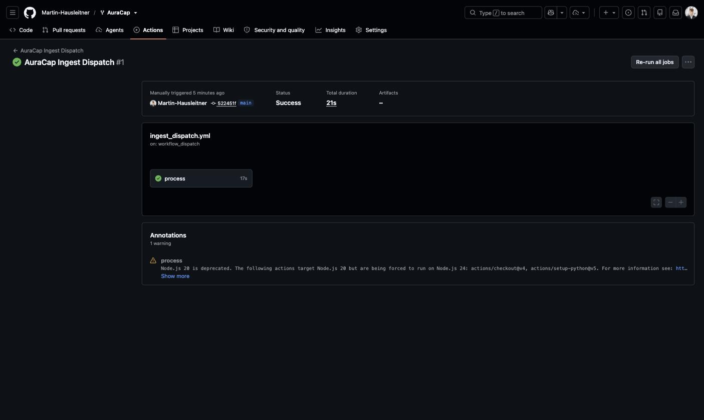
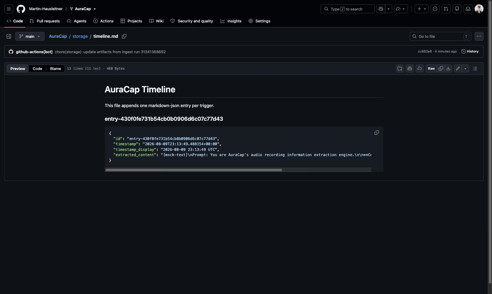
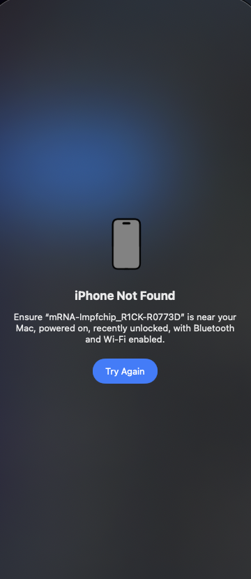

[ L276 · R2234 ] 🦀 CC · Modell: Fable 5 (Manager, Mac) · 🧠 IDR: nein (Build/E2E-Lauf) · 🕐 gerade eben
> 🧠 [NotebookLM](https://notebooklm.google.com/notebook/806a2bbd-c113-4b95-8e4c-191fc6ee4d2f) *(iPhone-CU-Research-Notebook; dediziertes AuraCap-Notebook pending — NotebookLM-Quota erschöpft, wird nachgezogen)*

# 📱 AuraCap E2E — Fork + Soniox-STT + Pipeline-Hook

**OpenSpec:** `openspec/changes/auracap-e2e-soniox/` (proposal + tasks + Spec-Delta, `validate --strict` ✅)
**Fork:** <https://github.com/Martin-Hausleitner/AuraCap> · Inbox-Release `auracap-inbox` (ID `367609186`)

---

## ✅ ERLEDIGT

🦀 **OpenSpec-Change** `auracap-e2e-soniox` ██████████ 100% sicher
   proposal + tasks + Akzeptanzkriterien, `openspec validate --strict` grün

🦀 **Fork-Setup** ██████████ 100% sicher
   Fork erstellt, Actions aktiv (`allowed_actions:all`), 4 Workflows registriert, Release-Inbox angelegt (ID **367609186**). Default-Provider = `mock` → **keine AI-Secrets nötig** für Basis-Betrieb.

🦀 **E2E-Smoke (CLI-Pfad, echter Cloud-Durchlauf)** ██████████ 100% sicher
   Echte m4a-Datei → Release-Asset (id 508011648) → `ingest_dispatch`-Action **Success (21 s)** → Timeline-Eintrag `entry-430f0fe7…` von `github-actions[bot]` committed. Das ist exakt der Pfad, den der iPhone-Shortcut nutzt (Upload-URL + workflow_dispatch identisch).

   
   

🦀 **Soniox-STT-Stufe** (Code) █████████░ 90% sicher
   `backend/app/providers/soniox_provider.py` (async REST: upload → create → poll → transcript, doc-verifiziert gegen soniox.com/docs, Modell `stt-async-v5`), Factory/Config/`.env.example` verdrahtet, Transkript läuft in die Timeline-Trace. **28/28 Tests grün** (5 neue Soniox-Tests, httpx-gemockt). Ohne `SONIOX_API_KEY` → sauberer Fallback (Spec-Szenario erfüllt). Commit `91bf117`, gepusht.

🦀 **vcvm-Pipeline-Hook (transcribe-hub)** ██████████ 100% sicher
   `backend/app/sync/transcribe_hub_adapter.py` — env-gated (`TRANSCRIBE_HUB_URL`, Default AUS = kein externer Call, testverifiziert), Payload `{source:"auracap", capture_id, media_type, mime_type, transcript, locale, captured_at}`. Doku: `docs/TRANSCRIBE_HUB.md` (Richtung Hans/vcvm-Diarization).

## 🔄 LÄUFT

🦀 **Negativ-Test Soniox-Auth** ██████████ 100% sicher
   Route-lab-Temp-Key (Desktop-Session, eigenes Konto) wird von der Async-API korrekt mit 401 abgelehnt → Provider wirft sauber `ProviderError` (kein Crash). Echter Cloud-Lauf braucht dauerhaften Key (s. FRAGEN).

## 👀 BITTE DRÜBERSCHAUEN / BLOCKIERT

📱 **iPhone-E2E** ███░░░░░░░ 30% 🔎 blockiert
   iPhone-Mirroring meldet dauerhaft **„iPhone Not Found"** (2× Retry erfolglos) — das iPhone 17 Pro („mRNA-lmpfchip_R1CK-R0773D") muss **nahe am Mac, eingeschaltet, kürzlich entsperrt, BT+WLAN an** sein. Physisch nur durch Martin lösbar. Watcher läuft — sobald verbunden: Voice-Shortcut via iCloud-Link installieren (README `docs/GITHUB_RELEASE_INBOX.md`), konfigurieren (Owner/Repo/Token/Release-ID 367609186), echte Aufnahme, Proofs.

   

⚠️ **CI-Commit lokal gefangen** — `ci: add Soniox env plumbing…` (SONIOX_API_KEY/-MODEL in beide Workflows) kann nicht gepusht werden: gh-Token hat keinen **`workflow`-Scope** (GitHub lehnt Workflow-Datei-Pushes ab). Fix: s. FRAGEN.

## 📐 Quality-Gate (Akzeptanzkriterien aus OpenSpec)

| Kriterium | Status |
|---|---|
| Echte Aufnahme → Release-Asset → Action grün → Timeline-Eintrag | 🟢 verifiziert (CLI-Pfad, echte Cloud-Action) — 🟠 iPhone-Variante blockiert |
| Soniox-Stufe: Audio → Transkript → Timeline, Key nur als Secret | 🟢 Code + Tests · 🟠 Cloud-Lauf pending Key + workflow-Scope |
| Kein-Key-Fallback ohne Fehler | 🟢 testverifiziert |
| Hub-Stub default AUS, env-gated, Schema dokumentiert | 🟢 testverifiziert |
| Proof-Screenshots in `.proof/`, inline | 🟢 (3 Bilder oben) |

## ❓ FRAGEN

Q1  iPhone-E2E fortsetzen: iPhone 17 Pro kurz neben dem Mac entsperren (BT+WLAN an), dann übernehme ich via Mirroring?
    [1] Ja, iPhone ist jetzt bereit ⭐   [2] Später, Report so freigeben   [3] iPhone-Teil streichen

Q2  `workflow`-Scope für den CI-Push: im Terminal `! gh auth refresh -h github.com -s workflow` ausführen (Device-Login, nur du kannst das)?
    [1] Mache ich jetzt ⭐   [2] CI-Commit verwerfen, Soniox nur lokal

Q3  Dauerhaften Soniox-Key (console.soniox.com → API Keys) erstellen und als Secret setzen lassen (`gh secret set SONIOX_API_KEY -R Martin-Hausleitner/AuraCap`)?
    [1] Key erstelle ich, dann setzt du ihn ⭐   [2] Ohne echten Soniox-Cloud-Lauf abschließen

───
📋 **Zusammenfassung:** Fork läuft, echter Cloud-E2E (CLI-Pfad) grün mit Timeline-Proof, Soniox-Stufe + Hub-Stub implementiert und getestet (28/28). Offen: iPhone physisch nicht erreichbar (nur Martin), `workflow`-Scope für CI-Push, dauerhafter Soniox-Key.
